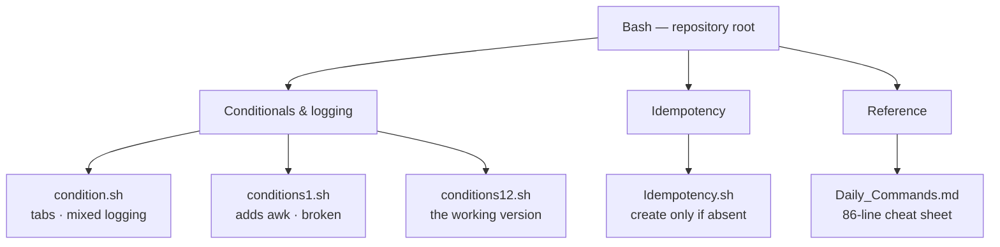
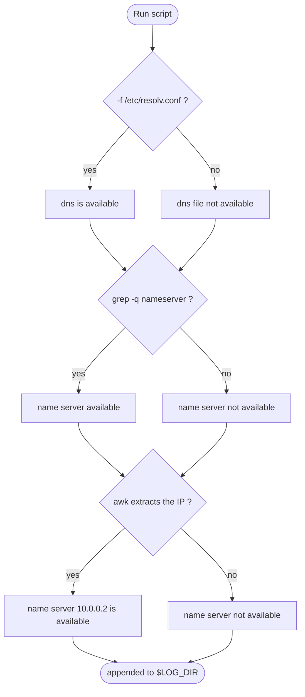
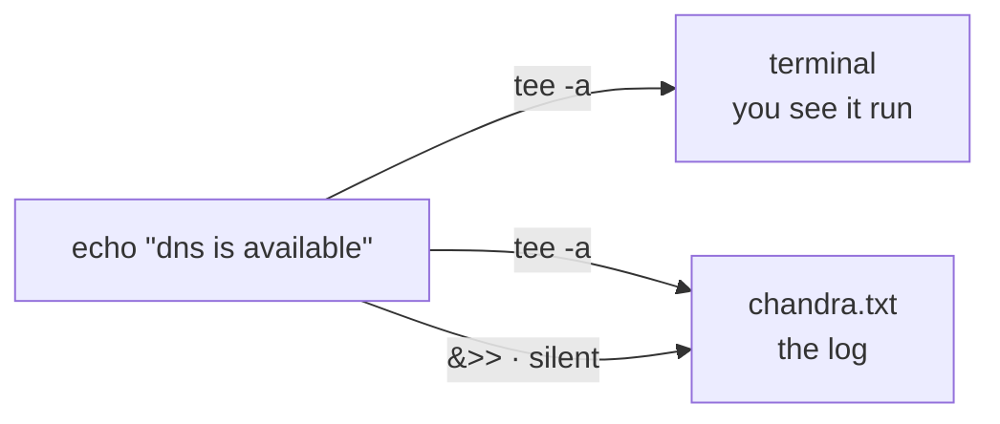
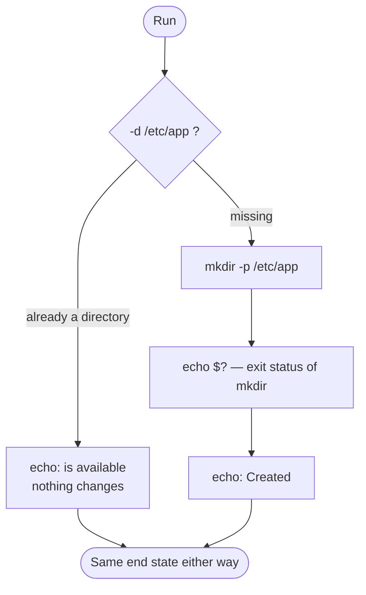
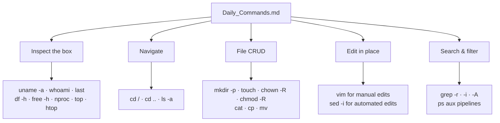
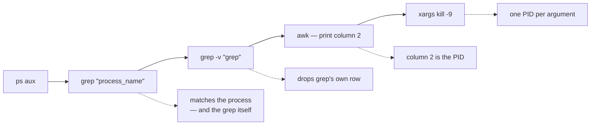

# Bash

*Linux and Bash scripting practice — small scripts on conditionals, logging and idempotency, plus a working command cheat sheet.*


## Overview

A learning repository, not a product. It holds the scripts written while working
through Bash fundamentals — testing for files, branching on the result, logging both
outcomes, and writing operations that are safe to run twice — alongside
`Daily_Commands.md`, a cheat sheet of the Linux commands that come up daily in
DevOps work.

The scripts are deliberately repetitive: three of them solve the same problem three
ways, and comparing them is the point. Where one of them is broken, it is left broken
and [documented](#known-issues) rather than quietly fixed, because the difference
between `conditions1.sh` and `conditions12.sh` *is* the lesson.

> The repository also contains an `eks/` directory of Kubernetes manifests. That work
> is not documented here yet.

## What's in the repo



## The scripts

| File | What it does | State |
|---|---|---|
| `condition.sh` | Checks `/etc/resolv.conf` exists, then greps it for a `nameserver` entry. | Runs |
| `conditions1.sh` | Adds a third check that extracts the nameserver IP with `awk`. | **Broken** — see [Known issues](#known-issues) |
| `conditions12.sh` | The corrected `conditions1.sh`. All three checks parse and run. | Runs |
| `Idempotency.sh` | Creates `/etc/app` only if it is not already a directory. | Runs (needs root) |
| `bash commands.sh` | — | **Empty (0 bytes)** |
| `Daily_Commands.md` | Linux command reference. | Reference |

### The shared pattern: test, branch, log

All three `condition*.sh` scripts drill the same shape — the core loop of any
pre-flight check in a deployment script. Each stage logs on **both** branches, so the
log tells you what was checked, not just what failed:



Two details separate the three files.

**`grep` vs `grep -q`.** `condition.sh` uses bare `grep`, so the matched line prints to
the terminal as a side effect of the test. `conditions1.sh` and `conditions12.sh` use
`grep -q`, which tests silently — only the exit status drives the `if`.

**The `find | xargs` idiom.** All three locate the file with
`find /etc -name "resolv.conf" | xargs grep`, rather than grepping the path directly.
That is the form worth knowing: it survives the file being somewhere unexpected.

### Where the output goes

The scripts use two different redirection styles, and the difference is visible at the
terminal. `condition.sh` mixes both; the other two are consistent:



| Form | stdout | stderr | Terminal |
|---|---|---|---|
| `2>&1 \| tee -a $LOG_DIR` | appended | appended | **shown** |
| `&>>$LOG_DIR` | appended | appended | hidden |

`condition.sh` uses `tee -a` on line 6 and `&>>` on lines 8, 13 and 15 — so its first
message echoes and the rest do not. `conditions1.sh` and `conditions12.sh` use `tee -a`
throughout.

### Idempotency

An idempotent operation can run twice without changing the result the second time.
`Idempotency.sh` demonstrates the guard that makes `mkdir` safe to re-run:



`echo $?` immediately after `mkdir` prints that command's exit status — `0` for
success. It has to come first: `$?` is overwritten by the next command that runs.

## The command cheat sheet

`Daily_Commands.md` is 86 lines covering the commands that come up daily. It is
organised as shell comments rather than prose, so it doubles as something you can read
and something you can copy from:



### The `sed` recipes it collects

| Task | Command |
|---|---|
| Substitute in place | `sed -i 's/old/new/g' filename` |
| Insert a line at the top | `sed -i '1s/^/new_line_to_add\n/' filename` |
| Delete line 5 | `sed '5d' filename.txt` |
| Delete lines 2–5 | `sed '2,5d' filename.txt` |
| Delete line 12 to the end | `sed '12,$d' filename.txt` |
| Insert before line 3 | `sed '3i\new text' filename` |
| Insert after line 3 | `sed '3a\new text' filename` |

The note that matters: **`-i` edits the file permanently.** Drop it first and read the
output to check the match before committing to it.

### The pipeline worth memorising

The cheat sheet builds one pipeline up stage by stage — find a process and kill it.
Each stage is a lesson in itself:



The whole thing, as the cheat sheet builds it:

```bash
ps aux | grep "process_name" | grep -v "grep" | awk '{print $2}' | xargs kill -9
```

The `grep -v "grep"` stage is the one people miss: without it, the `grep` command
appears in its own results, and you feed its PID to `kill`.

## Prerequisites

| Requirement | Why |
|---|---|
| Bash 4+ | All scripts use `#!/bin/bash` |
| A Linux host | The scripts read `/etc/resolv.conf` and write to `/etc` |
| Root or `sudo` | `Idempotency.sh` creates `/etc/app` |

## Quick start

```bash
git clone https://github.com/meshekar51/Bash.git
cd Bash
```

Run the working DNS check and read what it logged:

```bash
bash conditions12.sh
cat chandra.txt
```

Expected output in `chandra.txt` on a host with a normal resolver:

```text
dns is available
name server available
name server 10.0.0.2 is available
```

Then the idempotency demo — run it twice and compare:

```bash
sudo bash Idempotency.sh   # creates /etc/app
sudo bash Idempotency.sh   # reports it is already available
```

## Configuration

No `.env` file. Both values are set inline at the top of the scripts that use them.

| Variable | Description | Default | Set in |
|---|---|---|---|
| `LOG_DIR` | The log **file** the DNS checks append to — a file path despite the name | `./chandra.txt` | `condition.sh`, `conditions1.sh`, `conditions12.sh` |
| `DIR` | The directory `Idempotency.sh` ensures exists | `/etc/app` | `Idempotency.sh` |

## Project structure

```text
.
├── Daily_Commands.md    # 86-line Linux command cheat sheet
├── condition.sh         # DNS checks — tab-indented, mixed logging styles
├── conditions1.sh       # adds awk IP extraction — has a syntax error
├── conditions12.sh      # the corrected version of conditions1.sh
├── Idempotency.sh       # create /etc/app only if absent
├── bash commands.sh     # empty
└── eks/                 # Kubernetes manifests — not documented yet
```

## Testing

There is no test suite. The check that applies to a script repository is a parse pass,
which catches syntax errors without executing anything:

```bash
bash -n condition.sh conditions12.sh Idempotency.sh
```

That passes. `bash -n conditions1.sh` fails, by design — see below.

## Known issues

Real defects in the files, recorded rather than silently fixed. In a practice
repository these are the material.

- **`conditions1.sh:19`** — unterminated single quote in `awk '{print $2}`. `bash -n`
  reports *unexpected EOF while looking for matching `'`*. `conditions12.sh` is the
  corrected form; diffing the two is the exercise.
- **`bash commands.sh`** — empty, and the space in the filename means it has to be
  quoted everywhere it is referenced.
- **`.condition.sh.swp`** — a 12 KB Vim swap file was committed. It is editor state,
  not source. Now covered by `.gitignore`, but still tracked from an earlier commit.
- **`Daily_Commands.md:6`** — `PWD` is the shell variable. The command is lowercase
  `pwd`.
- **`Daily_Commands.md:39,46`** — `chmod 644 -R /app/folder` strips the execute bit
  from directories, which makes them un-enterable. Directories need `755`; use
  `find … -type d -exec chmod 755 {} +` to set files and directories differently.
- **`Idempotency.sh:3`** — `for path in $DIR` loops over a single-valued variable. The
  loop does nothing a plain `if` would not, unless `DIR` is later extended to a list.

<!-- TODO: which course or training these exercises came from -->
<!-- TODO: confirm whether "bash commands.sh" is an intended placeholder or should be removed -->
<!-- TODO: no LICENSE file present — choose one before others reuse this -->

## Contributing

Personal practice repository. If you spot an error in a script or the cheat sheet, an
issue or pull request is welcome — [Known issues](#known-issues) is the place to start.

## License

<!-- TODO: no LICENSE file present -->
No license file is present, so default copyright applies and no reuse rights are
granted.

## Contact

Chandrashekar G — meshekar5@gmail.com
[github.com/meshekar51/Bash](https://github.com/meshekar51/Bash)
